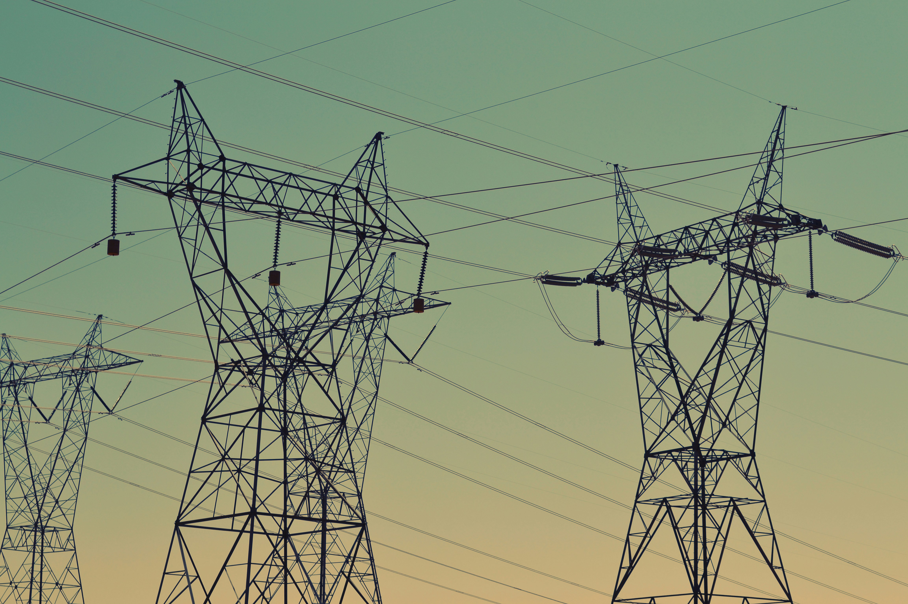

# ⚡ Electricity Load Forecasting Project 🔮




This project focuses on forecasting electricity demand using a combination of machine learning and deep learning models. The models implemented include LSTM, Linear Regression, Gradient Boosting, LightGBM, ARIMA, and SARIMA. Comprehensive evaluation metrics, visualizations, and insights are provided to compare model performances and understand their strengths and weaknesses.

---

## 📋 Table of Contents

1. [Introduction](#introduction)
2. [📊 Dataset](#dataset)
3. [💻 Installation](#installation)
    - [Prerequisites](#prerequisites)
    - [Clone the Repository](#clone-the-repository)
    - [Install Required Libraries](#install-required-libraries)
    - [Data Setup](#data-setup)
4. [🚀 Usage](#usage)
    - [Running the Project](#running-the-project)
    - [Using Jupyter Notebooks](#using-jupyter-notebooks)
5. [🧠 Models](#models)
6. [📈 Evaluation and Findings](#evaluation-and-findings)
    - [Metrics Used](#metrics-used)
    - [Observations](#observations)
    - [Insights](#insights)
7. [📉 Results and Visualizations](#results-and-visualizations)
    - [Visualizations](#visualizations)
    - [How to View Results](#how-to-view-results)
8. [🔮 Future Improvements](#future-improvements)
9. [📂 Project Structure](#project-structure)
10. [🙏 Acknowledgments](#acknowledgments)
11. [📝 License](#license)

---

## Introduction

Accurate forecasting of electricity demand is essential for optimizing resource allocation, ensuring grid stability, and minimizing operational costs in the energy sector. This project leverages both statistical and machine learning techniques to analyze historical electricity load data and predict future demand.

### 🎯 Objectives

- **Model Comparison:** Evaluate and compare the performance of multiple predictive models.
- **Visualization:** Provide clear and insightful visualizations to interpret model results.
- **Insights and Improvements:** Identify potential areas for enhancing model accuracy and reliability.

---

## 📊 Dataset

The dataset utilized in this project is sourced from Kaggle:

- **[Electricity Load Forecasting Dataset](https://www.kaggle.com/datasets/saurabhshahane/electricity-load-forecasting)** by [Saurabh Shahane](https://www.kaggle.com/saurabhshahane).

### 📝 Dataset Description

- **Frequency:** Hourly electricity load data.
- **Features:** Includes various features such as temperature, day of the week, holidays, and more.
- **Target Variable:** `DEMAND` representing the electricity load.

---

## 💻 Installation

To set up and run this project on your local machine, follow the steps below.

### Prerequisites

- **Operating System:** Windows, macOS, or Linux.
- **Python:** Version 3.9 or later.
- **Git:** To clone the repository.

### Clone the Repository

```bash
git clone https://github.com/Btry123/electricity-forecasting.git
cd electricity-forecasting

🛠️ Create and Activate a Virtual Environment

It’s recommended to use a virtual environment to manage project dependencies.

# Create a virtual environment named 'electricity_load_env'
python -m venv electricity_load_env

# Activate the virtual environment
# Windows:
electricity_load_env\Scripts\activate

# macOS/Linux:
source electricity_load_env/bin/activate

📦 Install Required Libraries

Install all necessary Python libraries using the provided requirements.txt file.

pip install -r requirements.txt


📂 Data Setup
	1.	Download the Dataset:
	•	Visit the Kaggle dataset page and download the dataset.
	2.	Organize the Data:
	•	Extract the downloaded files and place them into the archive/ directory within the project folder.
	3.	Verify File Paths:
	•	Ensure that the file paths in the code match the location of the dataset files. Update them if necessary.

🚀 Usage

Running the Project
	1.	Activate the Virtual Environment:
	•	Ensure your virtual environment is active.
	2.	Execute the Main Script:

python main.py

This will run the entire pipeline, including data preprocessing, model training, evaluation, and visualization.

Using Jupyter Notebooks


🧠 Models

The project implements the following forecasting models:
	1.	LSTM (Long Short-Term Memory):
	•	A deep learning model effective for capturing temporal dependencies in time-series data.
	2.	Linear Regression:
	•	A statistical model that establishes a relationship between dependent and independent variables.
	3.	Gradient Boosting:
	•	An ensemble learning technique that builds models sequentially to reduce errors.
	4.	LightGBM:
	•	A gradient boosting framework that uses tree-based learning algorithms, optimized for speed and performance.
	5.	ARIMA (AutoRegressive Integrated Moving Average):
	•	A univariate time series model that captures autocorrelations in the data.
	6.	SARIMA (Seasonal ARIMA):
	•	An extension of ARIMA that accounts for seasonality in the data.

Each model is trained on the preprocessed dataset and evaluated using standardized metrics to ensure fair comparison.

📈 Evaluation and Findings

Metrics Used

To assess the performance of each model, the following metrics are employed:
	•	RMSE (Root Mean Square Error): Measures the average magnitude of the errors.
	•	MAE (Mean Absolute Error): Represents the average absolute difference between predicted and actual values.
	•	MAPE (Mean Absolute Percentage Error): Indicates the accuracy as a percentage, showing the average absolute percentage error.

Observations
	1.	LSTM:
	•	Excels at capturing long-term dependencies within the data.
	•	Achieves the lowest RMSE and MAE but has a relatively higher MAPE.
	2.	LightGBM and Gradient Boosting:
	•	Offer faster training times with competitive accuracy.
	•	Balance between absolute errors and percentage errors.
	3.	Linear Regression:
	•	Simpler model with larger RMSE and MAE.
	•	Maintains a reasonable MAPE, indicating decent proportional accuracy.
	4.	ARIMA and SARIMA:
	•	Suitable for capturing trends and seasonality.
	•	Struggle with complex patterns, resulting in higher errors.

Insights
	•	Feature Engineering:
	•	Incorporating cyclical encoding for time-related features (e.g., hour of day, day of week) significantly enhances model performance.
	•	Hyperparameter Tuning:
	•	Fine-tuning parameters such as learning rate and dropout rates is crucial for optimizing deep learning models like LSTM.
	•	Model Selection:
	•	Ensemble methods like LightGBM provide a good balance between performance and computational efficiency.

📉 Results and Visualizations

Visualizations

The project generates various plots to compare actual vs. predicted electricity demand:
	1.	Hourly Predictions:
	•	Displays model performance at an hourly resolution.
	2.	Daily Predictions:
	•	Aggregates predictions to show daily trends and performance.
	3.	Monthly Predictions:
	•	Provides a long-term view of demand forecasts and model accuracy.

How to View Results

After running the project:
	•	Visualizations:
	•	Plots are saved in the visualizations/ directory.
	•	You can view them directly or through the Jupyter Notebook interface.
	•	Model Performance:
	•	Evaluation metrics are printed in the console or notebook outputs for quick reference.

🔮 Future Improvements

To further enhance the project’s performance and applicability, consider the following:
	1.	Incorporating Additional Weather Data:
	•	Include more granular weather features such as wind speed, humidity, and precipitation to improve model accuracy.
	2.	Automated Hyperparameter Tuning:
	•	Implement techniques like Grid Search or Bayesian Optimization to automate the hyperparameter selection process for models like ARIMA/SARIMA.
	3.	Advanced Data Imputation:
	•	Use sophisticated methods to handle missing data, ensuring data quality and consistency.
	4.	Model Ensemble Techniques:
	•	Combine predictions from multiple models to leverage their strengths and improve overall forecasting accuracy.
	5.	Real-Time Forecasting:
	•	Adapt the models for real-time electricity demand forecasting to provide timely insights for operational decisions.

📂 Project Structure

electricity-forecasting/
├── data/
│   ├── train_dataframes.xlsx
│   ├── test_dataframes.xlsx
│   └── ... (other data files)
├── visualizations/
│   ├── hourly_predictions.png
│   ├── daily_predictions.png
│   └── monthly_predictions.png
├── notebooks/
│   └── forecasting_analysis.ipynb
├── src/
│   ├── main.py
│   ├── models.py
│   ├── utils.py
│   └── ... (other source files)
├── requirements.txt
├── README.md
└── LICENSE

	•	data/: Contains all dataset files.
	•	visualizations/: Stores generated plots and figures.
	•	notebooks/: Includes Jupyter Notebooks for exploratory analysis and model development.
	•	src/: Contains source code files for the project.
	•	requirements.txt: Lists all Python dependencies.
	•	README.md: Project documentation (this file).
	•	LICENSE: Licensing information.

🙏 Acknowledgments
	•	Dataset: Special thanks to Saurabh Shahane for providing the Electricity Load Forecasting Dataset on Kaggle.
	•	Open-Source Community: Gratitude to all contributors of the open-source libraries used in this project, including PyTorch, scikit-learn, LightGBM, and statsmodels.

📝 License

This project is licensed under the MIT License. You are free to use, modify, and distribute this project as per the license terms.
